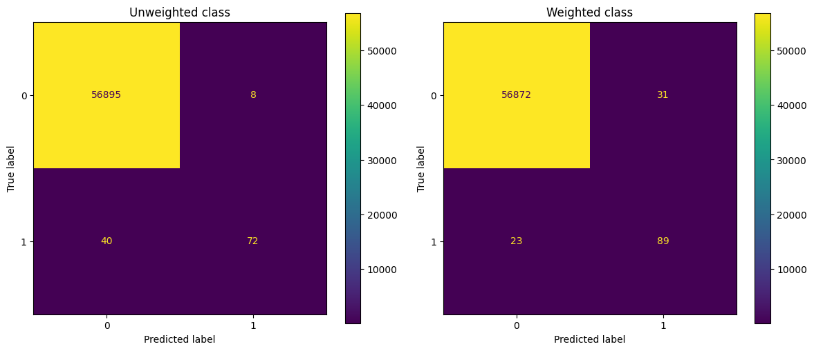

# Credit Card Fraud Detection with PySpark

Detecting fraudulent transactions using PySpark's distributed machine learning capabilities.

---

## Project Overview

This project tackles the **Credit Card Fraud Detection** problem using PySpark and Logistic Regression. The dataset is highly imbalanced,
so the model is trained using both **standard logistic regression** and a **class-weighted approach** to improve fraud detection.

The goal is to showcase:
- Familiarity with **PySpark ML pipelines**
- Handling **class imbalance**
- Building **scalable** ML models on large datasets
- Applying **evaluation metrics** like AUC and confusion matrix

---

## Tech Stack

- **Apache Spark (PySpark)** – distributed data processing
- **MLlib** – Spark's machine learning library
- **Sklearn** – evaluation (confusion matrix, classification report)
- **Matplotlib** – plotting confusion matrices

---

## Dataset

The dataset is from Kaggle’s [Credit Card Fraud Detection](https://www.kaggle.com/mlg-ulb/creditcardfraud) competition.

- 284,807 transactions
- 492 are fraudulent (~0.17%)
- Features: `V1` to `V28` (PCA components), `Time`, `Amount`, and `Class`

---

## Pipeline Highlights

- **VectorAssembler** was used to combine input features.
- A **Pipeline** was used for the weighted model to streamline transformations and training.
- Weighted logistic regression increased fraud recall significantly.


---

## Repo Structure

    credit-card-fraud-detection-pyspark/
        ├── demo.ipynb # Notebook demo with full code and visualizations
        ├── demo_script.py # Equivalent Python script version
        ├── README.md # Project overview (you're here)

---

## Getting Started

### Requirements

```bash
 Install dependencies with:

    pip install -r requirements.txt
    
```
 ### Running the Demo:
 ```bash
     python demo_script.py
     demo.ipynb
 ```    
---

## Results

    | Metric                            | Unweighted Model | Weighted Model |
    |-----------------------------------|------------------|----------------|
    | AUC                               | 0.9560           | 0.9783         |
    | Fraud Recall (Recall for class 1) | 0.64             | **0.79**       |
    | Fraud Precision                   | 0.90             | 0.74           |
    | Fraud F1-score                    | 0.75             | **0.77**       |

---

###  Class Distribution in Test Set


    | Label | Count |
    | ----- | ----- |
    | 0     | 56903 |
    | 1     | 112   |

---

###  Confusion Matrix (Unweighted)


    | Actual \ Pred | 0     | 1  |
    |---------------|-------|----|
    | **0**         | 56895 | 8  |
    | **1**         | 40    | 72 |

---

### Confusion Matrix (Weighted)

    | Actual \ Pred | 0     | 1  |
    |---------------|-------|----|
    | **0**         | 56872 | 31 |
    | **1**         | 23    | 89 |

---

### Confusion Matrices (side by side)



---

## Conclusion

Even with a simple model like logistic regression, **proper preprocessing, class rebalancing, and distributed processing** can significantly enhance
fraud detection in large-scale datasets.

---

##  Next Steps

- Add additional models (e.g., Random Forest, GBT)
- Use SMOTE or undersampling methods for class balancing
- Perform hyperparameter tuning using Spark’s `CrossValidator`
- Deploy in streaming mode for real-time fraud detection (Structured Streaming)

---
